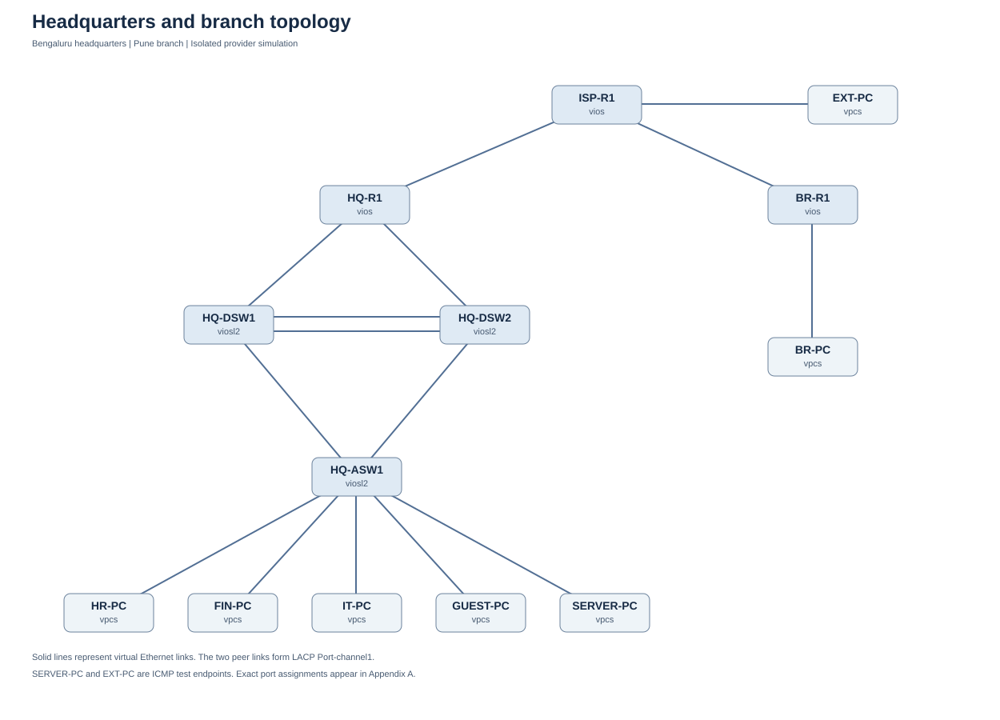

# Enterprise Network Lab — CCNA

A multi-site enterprise network built in EVE-NG, connecting a headquarters and branch through a simulated provider. The project combines departmental segmentation, dynamic routing, redundant headquarters gateways, and controlled access to an external test network.

**Author:** Utsav Chopda · **Platform:** EVE-NG · **Lab:** 13 nodes / 15 links

[Project report (PDF)](reports/Utsav_Chopda_Network_Project_Report.pdf) · [Read the report](reports/Project_Report.md) · [Import the lab](lab/IMPORT_Enterprise_Network_CCNA.zip)

## Topology

The headquarters uses two distribution switches and one access switch. A separate router serves the branch. Three IOSv routers, three IOSvL2 switches, and seven VPCS endpoints provide the complete lab environment.

## What the project covers

| Area | Implementation |
| --- | --- |
| Segmentation | Departmental VLANs, 802.1Q trunks, SVIs, dedicated management VLAN |
| Switching | Rapid PVST+, LACP EtherChannel, PortFast, BPDU Guard |
| Routing | Single-area OSPFv2, passive interfaces, advertised default route |
| Gateway redundancy | HSRPv2, preemption, routed-uplink tracking |
| Address assignment | Central DHCP at headquarters, DHCP relay, local branch DHCP |
| External access | PAT with inter-site traffic excluded from translation |
| Access controls | Guest IPv4 ACLs, sticky port security, unused-port shutdown |
| Operations | NTP, CDP/LLDP, buffered logging, verification and failure exercises |

## Network plan

| Segment | Subnet | Gateway |
| --- | --- | --- |
| HR / VLAN 10 | 10.10.10.0/24 | 10.10.10.1 |
| Finance / VLAN 20 | 10.10.20.0/24 | 10.10.20.1 |
| IT / VLAN 30 | 10.10.30.0/24 | 10.10.30.1 |
| Guest / VLAN 40 | 10.10.40.0/24 | 10.10.40.1 |
| Server / VLAN 50 | 10.10.50.0/24 | 10.10.50.1 |
| Management / VLAN 99 | 10.10.99.0/24 | 10.10.99.1 |
| Branch LAN | 10.20.10.0/24 | 10.20.10.1 |
| External test LAN | 203.0.113.0/24 | 203.0.113.1 |

Headquarters gateways are HSRP virtual addresses. See the [addressing guide](docs/02_ADDRESSING.md) for physical SVI addresses, loopbacks, and routed transit links.

## Run the lab

1. Provide licensed IOSv and IOSvL2 images in EVE-NG. Image identifiers and interface assignments are listed in the report and [cabling guide](docs/01_CABLING.md).
2. Import `lab/IMPORT_Enterprise_Network_CCNA.zip`. The editable `.unl` topology is also included.
3. Start the network devices sequentially, then the VPCS clients. This project uses an EVE-NG VM with 8 GB RAM; the six network nodes reserve 6 GB before overhead.
4. Open each console and apply the matching file from `configs/`. These are console-paste configurations; the topology archive does not automatically load them.
5. Follow the [verification guide](docs/03_VERIFY_AND_TROUBLESHOOT.md) to check forwarding, isolation, and redundancy. Restore the baseline after each failure exercise.

Image command support and available memory can vary. Review any rejected commands before proceeding.

## Design decisions

- **Gateway and switching roles align.** DSW1 is the preferred HSRP gateway and spanning-tree root; DSW2 provides the secondary path.
- **Uplink tracking affects gateway selection.** A failed routed uplink lowers the active switch's HSRP priority.
- **Guest access is constrained at the gateway.** DHCP remains available while private destination networks are denied.
- **Inter-site traffic preserves source addresses.** The PAT selection rules exclude internal destinations.

## Documentation

| File or directory | Purpose |
| --- | --- |
| [reports/](reports/) | Formal technical report in PDF, Word, and Markdown |
| [lab/](lab/) | Import archive and editable EVE-NG topology |
| [configs/](configs/) | Device-specific configuration files |
| [Cabling](docs/01_CABLING.md) | Port-to-port interface schedule |
| [Addressing](docs/02_ADDRESSING.md) | VLAN, subnet, and transit plan |
| [Verification](docs/03_VERIFY_AND_TROUBLESHOOT.md) | Acceptance checks and troubleshooting exercises |
| [Security extensions](docs/04_SSH_AND_SECURITY.md) | SSH, DHCP snooping, and DAI exercises |
| [Topic coverage](docs/05_TOPIC_COVERAGE_AND_EXTENSIONS.md) | Core coverage and extension scope |
| [Additional exercises](docs/06_EXTENSIONS.md) | IPv6, floating static routes, and router-on-a-stick |

## Scope and limitations

This is an educational emulation. The provider router participates in the same OSPF domain, and the external endpoint simulates outside connectivity. SERVER-PC is a VPCS reachability target. The project does not provide real internet access, application hosting, a stateful firewall, or an encrypted WAN.

Gateway redundancy does not eliminate the edge-router, access-switch, or DHCP single points of failure. Optional exercises are documented separately from the core design. The repository provides verification procedures; no measured throughput or failover-time claims are made.

Vendor images, credentials, and private keys are excluded.
